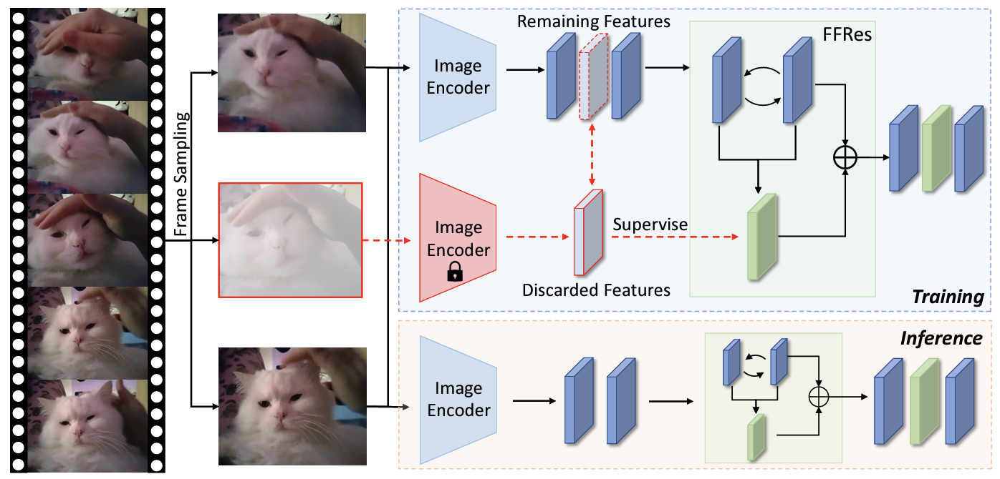

# SLLM

This is the released code for our paper "Sample Less, Learn More: Efficient Action Recognition via Frame Feature Restoration" [[Arxiv]](https://arxiv.org/abs/2307.14866), which will appear on ACMMM 2023.

In general, the proposed method, i.e., Sampel Less Learn More (SLLM), is a strategy for efficient video learning. The SLLM will first discard some sampled frames and restore the discarded features in latent space, and the computational cost of image encoding is reduced. SLLM can also be intergrated with other frame sampler strategies to achieve a better performance.

The released code is modified from [Text2Vis](https://github.com/whwu95/Text4Vis). 

 


## Quick Start

### Dataset

We applied the K400, UCF-101, HMDB-51, and ActivityNet as datasets for evaluating SLLM. The pre-preprocess of the datasets is identical with the [Text2Vis](https://github.com/whwu95/Text4Vis) and [ActionCLIP](https://github.com/sallymmx/ActionCLIP).
The annotation file is a text file with multiple lines, and each line indicates the directory to frames of a video, total frames of the video and the label of a video, which are split with a whitespace. Here is the format:

```
abseiling/-7kbO0v4hag_000107_000117 300 0
abseiling/-bwYZwnwb8E_000013_000023 300 0
```

For more details, please see the ./lists/

### Pre-trained Model

Ps: We will release more models soon.

| Backbone                     | Dataset | Link                                                         | ACC    | Efficiency (3090 GPU) |
| ---------------------------- | ------- | ------------------------------------------------------------ | ------ | --------------------- |
| Text2Vis (16 sampled frames) | HMDB    | [Google Drive](https://drive.google.com/file/d/1Apk9N5Y88VZXbfF7KGUnmV9cSxlFFrXF/view?usp=sharing) | 81.55% | 124.80 videos/s       |
|                              |         |                                                              |        |                       |
|                              |         |                                                              |        |                       |

### Inference

Please download the pre-trained model, and modify the line **test: /path/to/checkpoint/last_model.pt** in ./configs/[dataset_name]/[dataset]_test.yaml.

And use this code to run with our pretrained model:

`python train.py --config ./configs/hmdb51/hmdb_test.yaml`

## Citation

If you find this work is useful, please kindly cite it:

```
@article{DBLP:journals/corr/abs-2307-14866,
  author       = {Harry Cheng and
                  Yangyang Guo and
                  Liqiang Nie and
                  Zhiyong Cheng and
                  Mohan S. Kankanhalli},
  title        = {Sample Less, Learn More: Efficient Action Recognition via Frame Feature
                  Restoration},
  journal      = {CoRR},
  volume       = {abs/2307.14866},
  year         = {2023},
  url          = {https://doi.org/10.48550/arXiv.2307.14866},
  doi          = {10.48550/arXiv.2307.14866},
  eprinttype    = {arXiv},
  eprint       = {2307.14866},
  timestamp    = {Wed, 02 Aug 2023 15:37:53 +0200},
  biburl       = {https://dblp.org/rec/journals/corr/abs-2307-14866.bib},
  bibsource    = {dblp computer science bibliography, https://dblp.org}
}
```